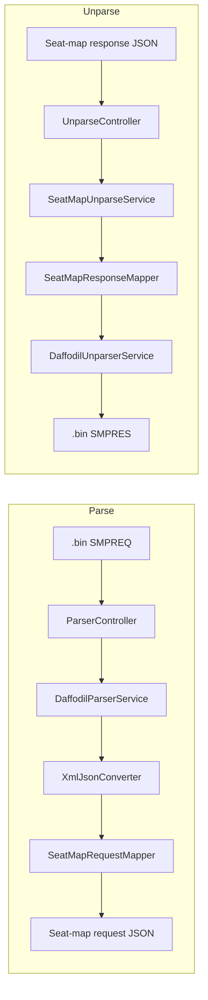

# dfdl-parser — Technical Design (Parse & Unparse)

This document explains **how parse and unparse actually work** in this project: request path, classes involved, DFDL schemas, field mapping, edge cases, and which sample files to use for verification.

**Stack:** Java 21 · Spring Boot 3.4 · Apache Daffodil 3.10 · IBM ACE DFDL XSDs (EBCDIC `IBM037`)

---

## 1. Purpose

| Direction | Input | Output | Schema |
|-----------|--------|--------|--------|
| **Parse** | EDIFACT SMPREQ `.bin` | Seat-map **request** JSON | `schemas/CYO_SMPREQ.xsd` |
| **Unparse** | Seat-map **response** JSON | EDIFACT SMPRES `.bin` | `schemas/CYO_SMPRES.xsd` |

Both directions use Apache Daffodil to convert between **binary** and an **XML infoset**. Business mappers then convert between that infoset and the seat-map JSON shapes used by downstream systems.

---

## 2. High-level architecture



### Key source files

| Layer | File |
|-------|------|
| Entry | `src/main/java/com/example/dfdl/Application.java` |
| Config | `src/main/java/com/example/dfdl/config/DaffodilConfiguration.java` |
| Config YAML | `src/main/resources/application.yml` |
| Parse API | `src/main/java/com/example/dfdl/controller/ParserController.java` |
| Unparse API | `src/main/java/com/example/dfdl/controller/UnparseController.java` |
| Diagnose API | `src/main/java/com/example/dfdl/controller/DiagnosticController.java` |
| Daffodil parse | `src/main/java/com/example/dfdl/service/DaffodilParserService.java` |
| Daffodil unparse | `src/main/java/com/example/dfdl/service/DaffodilUnparserService.java` |
| Request mapping | `src/main/java/com/example/dfdl/service/SeatMapRequestMapper.java` |
| Response mapping | `src/main/java/com/example/dfdl/service/SeatMapResponseMapper.java` |
| Unparse orchestration | `src/main/java/com/example/dfdl/service/SeatMapUnparseService.java` |
| XML↔JSON | `src/main/java/com/example/dfdl/util/XmlJsonConverter.java` |
| Errors | `src/main/java/com/example/dfdl/exception/GlobalExceptionHandler.java` |
| Request schema | `schemas/CYO_SMPREQ.xsd` |
| Response schema | `schemas/CYO_SMPRES.xsd` |
| Shared types | `schemas/CDE_Common.xsd` + `schemas/CDE_*.xsd` |

---

## 3. Runtime & schemas

### Startup

On boot:

1. `DaffodilParserService` compiles `daffodil.schema` → `CYO_SMPREQ.xsd` into a singleton `DataProcessor`.
2. `DaffodilUnparserService` compiles `daffodil.response-schema` → `CYO_SMPRES.xsd` into another `DataProcessor`.
3. `/health` is `UP` only when **both** compile successfully.

Schemas are **not** baked only into the JAR for runtime edits: Docker mounts `./schemas` → `/app/schema` (see `docker-compose.yml`).

### Encoding

ACE binaries for **parse and unparse are EBCDIC `IBM037`**, not ASCII/UTF-8.

| Layer | Encoding |
|-------|----------|
| Input `.bin` (SMPREQ) | EBCDIC IBM037 |
| Output `.bin` (SMPRES from `/unparse`) | EBCDIC IBM037 |
| Internal infoset XML | UTF-8 text (Daffodil infoset only) |
| API JSON request/response bodies | UTF-8 |

Declared in `schemas/CYO_SMPRES.xsd` / `CYO_SMPREQ.xsd` as `dfdl:encoding="IBM037"`.  
Client sample `samples/Response_SMPRES_4.bin` and API output `SMPRES.bin` both start with EBCDIC `U` (`0xE4`), not ASCII `U` (`0x55`).

`/health` reports `binaryEncoding: "IBM037"`, `binaryEncodingName: "EBCDIC"`.  
`/unparse` returns headers `X-DFDL-Binary-Encoding: IBM037` and `X-DFDL-Binary-Encoding-Name: EBCDIC`.

Do **not** switch to ASCII — ACE host systems expect EBCDIC.

### Important schema adaptations

| Change | Why | Where |
|--------|-----|--------|
| Flattened `CBD`/`ROD` under `SMPRESGroup1` | Nested Group2/Group3 broke Daffodil unparse | `schemas/CYO_SMPRES.xsd` |
| `TYPE_EQI_BLOB` for EQI | Client layout `EQI++++++B3S` | `schemas/CDE_EQI_BLOB.xsd` |
| Encoding / byte-order literals | Daffodil needs concrete values | Multiple XSDs |
| `FILLER` as `xsd:string` | hexBinary caused SDE | `CDE_EQI_BLOB.xsd` |

---

## 4. Parse flow (binary → JSON)

### 4.1 API

| Item | Value |
|------|--------|
| Endpoint | `POST /parse` |
| Body | `multipart/form-data`, field `file` = `.bin` |
| Response | JSON `ParseResponse` |
| Alternate | `POST /parse/sample/{fileName}` reads from `/app/samples` |

**Controller:** `ParserController.parse()` → `DaffodilParserService.parse(bytes)`.

### 4.2 Processing steps

```
.bin bytes
  → Daffodil DataProcessor.parse()          [CYO_SMPREQ.xsd]
  → XML infoset (UNB, UNH, ORG, TVL, …)
  → XmlJsonConverter.xmlToJson()
  → SeatMapRequestMapper.map()
  → ParseResponse { success, xml, json, infoset }
```

### 4.3 What Daffodil produces

Root element `SMPREQ` with EDIFACT segments defined by includes such as:

- `CDE_UNB_13_1.xsd` — interchange header  
- `CDE_UNH_13_1.xsd` — message header (`SMPREQ`)  
- `CDE_ORG_13_1.xsd` — organization / channel / currency  
- `CDE_TVL_13_1.xsd` — travel / flight segment  
- `CDE_UNT_13_1.xsd` / `CDE_UNZ_13_1.xsd` — trailers  

### 4.4 Business mapping (`SeatMapRequestMapper`)

Target shape: `samples/Request_seatmaprequest_2.txt`  
DTO: `src/main/java/com/example/dfdl/dto/SeatMapRequest.java`

| Output field | Source | Fallback (`application.yml`) |
|--------------|--------|------------------------------|
| `ChannelId` | *(not in EDIFACT)* | `daffodil.channel-id` → `4101` |
| `ChannelName` | `ORG.C336a_13.1.EL9906_CompanyId` (or `C336b`) | `default-channel-name` → `1A` |
| `CurrencyCode` | `ORG.C354.EL6345_CurrentcyCode` | `default-currency-code` → `USD` |
| `RecordLocator` / `ProductCode` | — | `""` |
| `FlightSegments[].DepartureAirport.IataCode` | `TVL.C328a.EL3225_LocationId` | — |
| `FlightSegments[].ArrivalAirport.IataCode` | `TVL.C328b.EL3225_LocationId` | — |
| `FlightSegments[].DepartureDateTime` | `TVL.C310.EL9916_FirstDate` (`DDMMYY` → `yyyy-MM-dd`) | — |
| `FlightSegments[].MarketingAirlineCode` | `TVL.C306.EL9906_CompanyId` | — |
| `FlightSegments[].FlightNumber` | `TVL.C308.EL9908_ProductId` | — |
| `ClassOfService` | — | `default-class-of-service` → `Y` |
| `Pricing` | — | `default-pricing` → `true` |

**Cases handled:**

| Case | Behavior |
|------|----------|
| Single `TVL` | One `FlightSegments` entry |
| Array of `TVL` | One segment per TVL |
| Infoset wrapped as `{ "SMPREQ": … }` | Unwraps root |
| Infoset already at segment level | Uses node directly |
| Missing ORG channel/currency | Config defaults |
| Empty / invalid binary | `DfdlParseException` → HTTP 400 |
| Schema not compiled | `DfdlSchemaException` → HTTP 500 |

### 4.5 Parse response shape

```json
{
  "success": true,
  "xml": "<SMPREQ>…</SMPREQ>",
  "json": { "ChannelId": "4101", "FlightSegments": [ … ] },
  "infoset": { "SMPREQ": { "UNB": …, "ORG": …, "TVL": … } }
}
```

- **`json`** — mapped payload for downstream (primary output)  
- **`xml` / `infoset`** — debug / audit of raw DFDL result  

### 4.6 Sample files (parse)

| File | Role |
|------|------|
| `samples/Request_SMPREQ_1.bin` or `sample_smpreq.bin` | Input binary |
| `samples/Request_seatmaprequest_2.txt` | Expected mapped JSON shape |

---

## 5. Unparse flow (JSON → binary)

### 5.1 API

| Item | Value |
|------|--------|
| Endpoint | `POST /unparse` |
| Body | `application/json` (seat-map **response**) |
| Response | `application/octet-stream` attachment `SMPRES.bin` |

**Controller:** `UnparseController.unparse()`  
**Orchestrator:** `SeatMapUnparseService.unparseSeatMapResponse()`  
1. `SeatMapResponseMapper.toSmpreXml(json)` → SMPRES XML  
2. `DaffodilUnparserService.unparseXml(xml)` → EBCDIC bytes  

### 5.2 Target ACE layout

Ground truth: `samples/Response_SMPRES_4.bin`  
Mapper comments and tests enforce this layout (not a generic SMPRES).

```
UNB
UNH
TVL
EQI
CBD
ROD…   (including Z facility rows and E exit rows)
UNT
UNZ
```

**No `ORG` segment** in the client ACE sample — the mapper does not emit ORG.

### 5.3 JSON input shape

Reference: `samples/Respone_seatmapresponse_3.txt`

| JSON path | Used for |
|-----------|----------|
| `transactionIdentifiers.transactionId` | Interchange / access refs |
| `transactionIdentifiers.channelName` | UNB recipient |
| `transactionIdentifiers.cabinCode` | Which cabin(s) to emit (e.g. `Y` only) |
| `flightInfo.*` | TVL |
| `aircraftInfo.icr` | EQI blob (e.g. `B3S`) |
| `cabins[].cabinType`, `layout`, `rows` | CBD + ROD |

### 5.4 Segment mapping detail (`SeatMapResponseMapper`)

#### UNB
- Sender fixed: `UA1SM`
- Recipient: `channelName` (fallback config `1A`)
- Date/time: current `yyMMdd` / `HHmm`
- Interchange ref: sanitized `transactionId` (max 14 chars)
- Test indicator: `T`

#### UNH
- Type `SMPRES`, version `93`, release `2`, agency `IA`

#### TVL (from `flightInfo`)
| JSON | EDIFACT |
|------|---------|
| `departureDate` | `C310` date `DDMMYY` |
| `departureAirport` / `arrivalAirport` | `C328a` / `C328b` |
| `marketingCarrierCode` | `C306` |
| `marketingFlightNumber` | `C308` product id + characteristic `L` |

Example: `TVL+211226+LAX+DEN+UA+1275:L`

#### EQI (from `aircraftInfo.icr`)
Uses `TYPE_EQI_BLOB`: five empty fillers + blob.

Example: `EQI++++++B3S`

#### CBD (per selected cabin)
| JSON | EDIFACT |
|------|---------|
| `cabinType` | `Y:::Y` style (`C342` class + compartment) |
| First/last row | Zero-padded `007:039` (`C052`) |
| Wing rows (`row.wing`) | Unpadded `14:24` (`C058`) |
| `layout` columns | `A:W+B:9+C:A+…` (`C054` + column desc) |

Empty positional fields are kept so separators match client `++++`.

#### ROD (per row)
| Case | Output |
|------|--------|
| Normal row with seats | `ROD+{n}++A:F:CH+B:F:CH+…` |
| Gap in row range (no JSON row) | `ROD+{n}+Z` (facility) |
| Exit row (`isExit` / `isDoorExit`) | `ROD+{n}+E+A:F:E:1+…` |
| Missing / removed seat for a layout column | `O:8` |
| Available + chargeable | `F:CH` |
| Available + middle (non-chargeable) | `F:9` |
| Occupied / unavailable | `O:8` |

**Chargeable** if preferred, extra pitch, category contains plus/preferred/premium, or fee &gt; 0.

#### Cabin filter
If `transactionIdentifiers.cabinCode` is `Y`, only the Y cabin is emitted (J is skipped) — matches client sample.

#### UNT / UNZ
- Segment count includes UNH + body + UNT (client: `UNT+38+1`)
- UNZ echoes interchange ref

### 5.5 Unparse cases summary

| Case | Behavior |
|------|----------|
| Valid full response JSON | Returns SMPRES `.bin` |
| Empty JSON body | HTTP 400 |
| Response schema not compiled | HTTP 500 `SCHEMA_ERROR` |
| Daffodil unparse failure | HTTP 400 with diagnostics |
| Multiple cabins, cabinCode set | Only matching cabin |
| Missing rows between first–last | Insert `Z` rows |
| Layout letter with no seat | Treat as `O:8` |

### 5.6 Sample files (unparse)

| File | Role |
|------|------|
| `samples/Respone_seatmapresponse_3.txt` | Unparse **input** JSON |
| `samples/Response_SMPRES_4.bin` | Client **reference** binary (layout ground truth) |
| `samples/SMPRES.bin` / `SMPRES_out.bin` | Generated unparse outputs for comparison |

### 5.7 How to verify unparse output

1. Call `/unparse` with the response JSON; save as `SMPRES.bin`.
2. Decode EBCDIC (IBM037) and compare segments to `Response_SMPRES_4.bin`.
3. Expect **exact** match on: `TVL`, `EQI`, `CBD` structure, ROD skeleton (including Z/E), `UNT+38`.
4. Expect **differences** on: UNB/UNH/UNZ refs, timestamps, recipient, and some seat O/F values when JSON inventory ≠ client snapshot.

---

## 6. API catalogue

| Method | Path | In | Out |
|--------|------|----|-----|
| `GET` | `/health` | — | Both schemas compile status |
| `GET` | `/ui/compare` | — | Browser compare UI page |
| `POST` | `/parse` | multipart `.bin` | Mapped request JSON (+ xml/infoset) |
| `POST` | `/parse/sample/{fileName}` | sample name | Same as `/parse` |
| `POST` | `/unparse` | response JSON | `SMPRES.bin` bytes |
| `POST` | `/compare` | multipart `clientFile` + `unparseFile` | Match report (verdict, checks, diffs) |
| `POST` | `/diagnose` | optional `.bin` | Compile/parse diagnostics |

### Compare API (`POST /compare`)

Compares client-shared SMPRES binary vs unparse output (both decoded as EBCDIC IBM037).

| Field | Meaning |
|-------|---------|
| `verdict` | `IDENTICAL` / `STRUCTURALLY_MATCHED` / `PARTIAL_MATCH` / `MISMATCH` |
| `matchPercent` | % of structural checks passed |
| `mismatchPercent` | Remaining % that did not match (`100 - matchPercent`) |
| `clientJson` / `unparseJson` | Both binaries extracted to readable JSON (envelope/flight/aircraft/cabin/rows) |
| `mismatchedValues` | Field-level diffs: `path`, `clientValue`, `unparseValue`, `category`, `explanation` |
| `mismatchDetails` | Present when not 100%; failed checks + why/impact + same `mismatchedValues` |
| `checks` | encoding, messageType, TVL/EQI/CBD/UNT, ROD skeleton, etc. |
| `matches` / `differences` | Readable lists |
| `segmentDiffs` | Per-segment status |

Classes: `CompareController`, `BinaryCompareService`, `BinaryCompareResponse`.

**Important (Windows):** use `http://127.0.0.1:8080` — `localhost` may hang on IPv6/WSL port relay.

---

## 7. Configuration reference

From `src/main/resources/application.yml`:

| Property | Env var | Default | Used by |
|----------|---------|---------|---------|
| `daffodil.schema` | `DAFFODIL_SCHEMA` | `/app/schema/CYO_SMPREQ.xsd` | Parse |
| `daffodil.response-schema` | `DAFFODIL_RESPONSE_SCHEMA` | `/app/schema/CYO_SMPRES.xsd` | Unparse |
| `daffodil.samples-dir` | `DAFFODIL_SAMPLES_DIR` | `/app/samples` | `/parse/sample` |
| `daffodil.channel-id` | `DAFFODIL_CHANNEL_ID` | `4101` | Parse mapper |
| `daffodil.default-channel-name` | `DAFFODIL_CHANNEL_NAME` | `1A` | Parse + unparse |
| `daffodil.default-currency-code` | `DAFFODIL_CURRENCY` | `USD` | Parse |
| `daffodil.default-class-of-service` | `DAFFODIL_CLASS_OF_SERVICE` | `Y` | Parse |
| `daffodil.default-pricing` | `DAFFODIL_PRICING` | `true` | Parse |

Docker: `docker-compose.yml` mounts schemas/samples and sets `DAFFODIL_SCHEMA`.

---

## 8. Error handling

| Exception | HTTP | When |
|-----------|------|------|
| `DfdlParseException` | 400 | Binary does not match SMPREQ schema |
| `DfdlUnparseException` | 400 | XML infoset cannot unparse to SMPRES |
| `DfdlSchemaException` | 500 | Schema missing / compile failed |
| `IllegalArgumentException` | 400 | Empty file/body |
| `MaxUploadSizeExceededException` | 400 | Upload &gt; 50MB |

Handler: `GlobalExceptionHandler`.

---

## 9. Tests that lock behavior

| Test | Documents |
|------|-----------|
| `SeatMapRequestMapperTest` | ORG/TVL → request JSON |
| `SeatMapResponseMapperTest` | ACE layout: no ORG, EQI, TVL `:L`, Z-rows, cabin filter |
| `DaffodilParserServiceTest` | Real Daffodil compile + parse |
| `UnparseControllerTest` | Returns attachment `SMPRES.bin` |
| `ParserControllerTest` | `/parse` and `/health` contracts |

---

## 10. End-to-end examples

### Parse

```bash
curl.exe -X POST http://127.0.0.1:8080/parse ^
  -F "file=@./samples/Request_SMPREQ_1.bin;type=application/octet-stream"
```

### Unparse

```bash
curl.exe -X POST http://127.0.0.1:8080/unparse ^
  -H "Content-Type: application/json" ^
  --data-binary @./samples/Respone_seatmapresponse_3.txt ^
  -o ./samples/SMPRES.bin
```

### Health

```bash
curl.exe http://127.0.0.1:8080/health
```

---

## 11. Design decisions (why it works this way)

1. **Two schemas** — SMPREQ and SMPRES are different ACE message types; one `DataProcessor` each.
2. **Mapper layer** — Daffodil only does binary↔XML; seat-map JSON is a product contract, not the infoset.
3. **ACE-aligned unparse** — Output is shaped like `Response_SMPRES_4.bin` (EQI blob, CBD layout, Z/E rows, no ORG), not a minimal theoretical SMPRES.
4. **Flattened groups** — Nested DFDL groups that ACE uses were flattened so Apache Daffodil can unparse reliably.
5. **Config defaults** — Fields absent from EDIFACT (e.g. `ChannelId`) come from `application.yml`.

---

## 12. Related docs

| Doc | Content |
|-----|---------|
| `README.md` | Quick start, curl examples, overview |
| `schemas/` | Full ACE DFDL XSD set |
| `samples/` | Binary and JSON fixtures |
| This file (`TECHNICAL_DESIGN.md`) | Deep dive on parse/unparse mechanics and cases |
